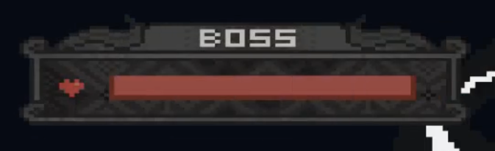
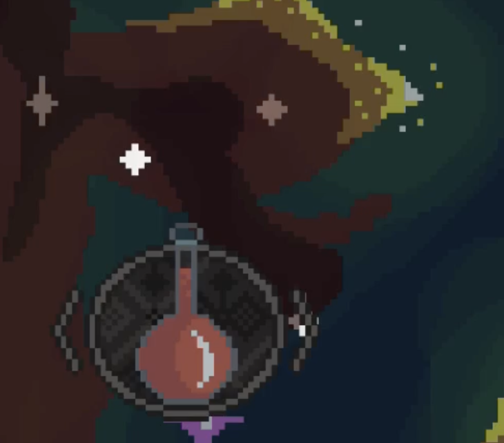

# Unnamed ARPG

## Context

I started my Unity journey with Portugal Tourism GP!, as a simple prototype (at first, later it evolved into a fully released game). The idea was to gauge how viable it would be to work with an isometric perspective I envisioned, play with prefabs and hone my game design and development skills. After building a small fully playable level, I moved on to a new project, an RPG with a detailed scope and well-thought-out gameplay systems. 

It was a story-driven pixel art RPG adventure, where the exploration and battles were done seamlessly, without battle transitions or a turn order system during combat.

This page provides an overview of the implemented systems and the design rationale behind them.

## Cutscenes
For the storytelling, I developed a Cutscene Manager to be able to direct cutscenes and merge them with the gameplay. It allowed for map title screens/introductions, in-scene conversations, character and camera manipulation, fade-in/fade-out and other custom events.
The system was designed to have each cutscene split into smaller parts that would be queued to play sequentially. This allowed changes in one part not to impact the rest of the cutscene, making adjustments easier. This approach also allowed for more flexibility in changing between conversation parts where the player was interacting, with scenes that played out on their own.

<video src="assets/arpg_prototype/cutscene_2.mp4" autoplay loop muted style="width:640px;"></video>

The Cutscene Manager worked as intended and, along with the gameplay and conversation systems, enabled all the necessary features to tell the story. Going forward, the focus was to create as many reusable cutscene parts as possible to be able to plug-and-play into the different cutscenes. Some minor cutscenes could repeat almost as is (think healing Pokémon at a Pokémon Center or making a delivery in Death Stranding). Other parts of cutscenes, like enemy movement, character expressions and camera movement could be reused in multiple cutscenes to speed up production. Of course this needs to be done tastefully so the repeating aspects are not obvious to the player.
I realized the importance of this when creating the cutscenes that are in the current build. These scenes took great effort to make, so making small bits of reusable assets would reduce development time significantly in future cutscenes.

I decided to make this cutscene management system from scratch as a learning tool. I gained useful experience and the process was very rewarding, but it was time-consuming. For a full production, I would do it differently by researching what the industry norms are for these systems. This would help avoid falling into known pitfalls that could have blindsided me.

## Gameplay
### Movement
I decided to restrict movement to the four isometric directions of tile movement (up-right, down-right, down-left and up-left). This reduced the number of sprites I had to create by half (vs 8 directions if I were to include up, down, left and right). This was especially important since I am not a professional artist and creating new sprites and animations was a significant time investment.

During combat and exploration, the character is controlled by using the arrow or WASD keys. Since the perspective is isometric, the keys don't line up with the direction of movement, as there is a 45º tilt. I used the approach Disgaea and Final Fantasy Tactics use and mapped the controls on the D-Pad/WASD as:
- Up -> Up-right
- Right -> Down-right
- Down -> Down-left
- Left -> Up-left 

This felt a little unnatural at first, but after a couple of minutes I adjusted and it became easy to navigate.

By double tapping in one direction, the player would be able to do a sidestep/small jump. This can be used to jump over small holes or gaps in the terrain when exploring, or, in combat, for quick repositioning. This movement drains stamina, demanding strategic thinking from the player when using it in battle. 

<video src="assets/arpg_prototype/dash_extended.mp4" autoplay loop muted style="width:480px;"></video>

After sending a test build to friends, I realized locking the game to the NW, NE, SE and SW directions was probably my biggest oversight. As an avid gamer and FFT lover, the movement felt relatively natural to me even if WASD/D-Pad didn't line up with the isometric directions. However, my friends had trouble controlling the character and had a hard time adjusting. They are gamers, just not exposed to FFT/FFTA on a WASD/D-Pad. Since this game is not a turn-based game like FFT, but a real-time action-focused one, this problem was probably a project killer if not addressed.

### Combat
The combat system is real-time. The player can move freely and so can the enemies. The player can use melee attacks and ranged magic spells. 

When the player presses the magic button, time stops (enemies and other map elements would stop moving) and the spell UI appears for the player to confirm how the magic is be cast. For each of the four spells, there is a respective UI system. 
For example, for the fire spell, the player has to select the direction in which the fireball will be shot. 

<video src="assets/arpg_prototype/spell_fire_anim.mp4" autoplay loop muted style="width:320px;"></video>

The player has access to magic that can be used as long as the player has the necessary mana for the respective spell. To regain mana, the player can stop and focus for a few seconds. 

<video src="assets/arpg_prototype/recover_mana.mp4" autoplay loop muted style="width:540px;"></video>

### Exploration
Outside of battle, the player can still use melee attacks and magic spells on interactable objects. Throughout the game, the player can make use of these mechanics to solve puzzles and progress through the maps. For example, in the initial tutorial, the player must use melee attacks to break an obstacle in order to advance. This approach is also used to teach the player how to use the magic spells. 
<video src="assets/arpg_prototype/breaking_object.mp4" autoplay loop muted style="width:480px;"></video>

## User Interface
### Player info and Battle
Regarding the UI, the player portrait was shown in the top-left corner of the map, along with health, mana and stamina.  

 

For the enemies, a dynamic UI was created. It appears when the enemies are aggroed and disappears after they are defeated. The enemy UI appears in the top-right corner, opposing the player's UI. In case of bosses, they have a unique look for the UI, to differentiate them. They function in a similar way with the exception that they are always on top to further reflect their importance and direct the player's focus. 

 

For the spell selection, the player can rotate between the available spells and see which one is currently selected in the spells UI at the bottom right of the screen. 

<video src="assets/arpg_prototype/ui_spells.mp4" autoplay loop muted style="width:320px;"></video>

As stated previously, for the fire spell, the player selects the direction in which to cast the spell. For the other spells, the player selects where they are used. The selected spell's area of effect is shown as a preview as part of the UI. 

   

During battle, the bottom-left UI shows which item is selected. The items are used to regain health or mana, for example. 

 

### Actions
The game used a pop-up icon above the player's head, akin to Final Fantasy IX, when actions were available to the player (talking to an NPC, investigating an object, opening a treasure chest). 

<video src="assets/arpg_prototype/actions.mp4" autoplay loop muted style="width:480px;"></video>

### Notifications
For in-game tutorials or notifications, a notification system was developed to show important information on the top-right corner of the screen. 

<video src="assets/arpg_prototype/ui_tutorial_attack.mp4" autoplay loop muted style="width:320px;"></video>

The tutorial shows the player how to move, use the action button and provide guidance on the mechanics of the combat system. 

### Conversations
For the conversations, I developed 4 conversation bubble sizes. The size of the chat bubble is dependent on the size of the current text message. In the current build, the size is selected manually for each message. The next step for this system is to create a function to determine the chat bubble size for each text message. Since the pixel art font I created is not monospaced, the function has to get the width of each character individually to get the size of the message and, based on that, determine the chat bubble size. 

<video src="assets/arpg_prototype/ui_chat.mp4" autoplay loop muted style="width:480px;"></video>

The balloon source indicator is dynamic and appears from the speaker. 
 
There are 4 types of bubbles: 
- Conversation bubbles 
- Obtaining items 
- Action information (e.g.: "The door has been unlocked") 
- Notifications/tutorial messages 

Regarding multiple languages/translations, at this point the game is being developed in portuguese only, but the idea is to do something similar to what I used in Portugal Tourism GP (you can check the logic out in its in-depth page) to also make the game available in English. 

### Treasure chests and items
For the chest UI, the special bubble shows up at the bottom-center displaying what the player has obtained. 

<video src="assets/arpg_prototype/chest.mp4" autoplay loop muted style="width:480px;"></video>

I developed the logic for storing the items in the inventory but, for this build, I have not implemented the inventory management UI, other than the ones used in battle that show up in the bottom-left corner of the screen.

## Final thoughts
This was just the prototype for the base gameplay loop, with some ideas I had. If continued, the final product would probably look very different as ideas were refined. As I was wrapping up the first build of the demo, I realized how big of task it is to develop a game alone in a reasonable amount of time. I have great respect for those who are able to follow this route and are able to release a full game on their own.

